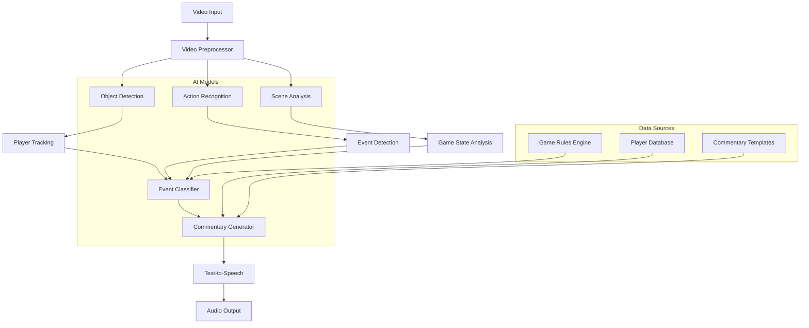

# Soccer Game Commentary System Design Document

## Overview
This system generates real-time audio commentary for soccer game video clips using computer vision, machine learning, and text-to-speech technologies.

## System Architecture

## Core Components

### 1. Video Processing Pipeline
- **Video Preprocessor**: Frame extraction, normalization, quality enhancement
- **Object Detection**: Detect players, ball, referee, goal posts using YOLO/R-CNN
- **Action Recognition**: Identify actions (kick, pass, tackle, shot) using 3D CNN
- **Scene Analysis**: Field segmentation, camera angle detection

### 2. Game Intelligence
- **Player Tracking**: Multi-object tracking across frames
- **Event Detection**: Goal, foul, corner kick, offside detection
- **Game State Analysis**: Score tracking, possession, field position

### 3. Commentary Generation
- **Event Classifier**: Categorize detected events by importance and type
- **Commentary Generator**: LLM-based text generation with context awareness
- **Text-to-Speech**: High-quality voice synthesis with emotion

### 4. Data Management
- **Player Database**: Player names, positions, statistics
- **Commentary Templates**: Pre-defined phrases and reaction patterns
- **Game Rules Engine**: Soccer rules and regulations

## Technical Requirements

### Hardware
- GPU: NVIDIA RTX 3070 or better (for real-time processing)
- RAM: 16GB minimum, 32GB recommended
- Storage: 100GB for models and data

### Software Stack
- **Computer Vision**: OpenCV, PyTorch, Detectron2
- **Machine Learning**: TensorFlow/PyTorch, Transformers
- **Audio Processing**: PyTorch Audio, gTTS/Coqui TTS
- **Backend**: Python 3.9+, FastAPI
- **Frontend**: React/Vue.js for web interface

## Implementation Plan

### Phase 1: Foundation (Weeks 1-4)
**Goal**: Basic video processing and object detection
- [ ] Set up development environment
- [ ] Implement video preprocessing pipeline
- [ ] Integrate pre-trained object detection model (YOLO)
- [ ] Basic player and ball tracking
- [ ] Simple event detection (goal scoring)

### Phase 2: Core Intelligence (Weeks 5-8)
**Goal**: Advanced game understanding
- [ ] Implement action recognition model
- [ ] Enhanced player tracking with ID persistence
- [ ] Multi-event detection (fouls, corners, offsides)
- [ ] Game state management system
- [ ] Player database integration

### Phase 3: Commentary Generation (Weeks 9-12)
**Goal**: Natural language commentary
- [ ] Design commentary templates and patterns
- [ ] Implement event classification system
- [ ] Integrate LLM for dynamic commentary generation
- [ ] Context-aware commentary (score, time, importance)
- [ ] Basic text-to-speech integration

### Phase 4: Audio Enhancement (Weeks 13-16)
**Goal**: High-quality audio output
- [ ] Advanced TTS with multiple voices
- [ ] Emotion and excitement modulation
- [ ] Real-time audio streaming
- [ ] Audio mixing with ambient crowd noise
- [ ] Performance optimization

### Phase 5: Polish & Features (Weeks 17-20)
**Goal**: Production-ready system
- [ ] Web interface for video upload
- [ ] Real-time processing optimization
- [ ] Commentary language options
- [ ] Historical match analysis
- [ ] System monitoring and logging

## Data Requirements

### Training Data
- **Video Datasets**: 
  - Soccer match footage (1000+ hours)
  - Annotated events and actions
  - Player tracking ground truth
- **Commentary Data**:
  - Professional commentary transcripts
  - Event-commentary pairs
  - Multi-language commentary samples

### Models to Train/Fine-tune
1. **Custom Action Recognition**: Soccer-specific actions
2. **Event Detection**: Game-specific events
3. **Commentary Generation**: Fine-tuned LLM on soccer commentary
4. **Voice Synthesis**: Custom voice models for commentators

## Performance Metrics

### Technical Metrics
- **Processing Speed**: <100ms per frame for real-time
- **Detection Accuracy**: >90% for players, >85% for ball
- **Event Detection**: >95% for goals, >80% for fouls
- **Commentary Quality**: Human evaluation scores

### User Experience Metrics
- **Response Time**: <2 seconds from event to commentary
- **Commentary Relevance**: User rating >4/5
- **Audio Quality**: Clear, natural speech
- **System Uptime**: >99% availability

## Risk Mitigation

### Technical Risks
- **Model Performance**: Use pre-trained models, gradual improvement
- **Real-time Processing**: Optimize with model quantization, GPU acceleration
- **Data Quality**: Implement robust validation and cleaning pipelines

### Business Risks
- **Copyright Issues**: Use royalty-free footage, generate synthetic commentary
- **Language Barriers**: Start with English, expand gradually
- **Competition**: Focus on unique features like emotion and context

## Future Enhancements

### Short-term (6 months)
- Multi-camera angle support
- Player statistics integration
- Mobile app development
- Cloud deployment

### Long-term (1+ years)
- Real-time broadcast integration
- AR/VR commentary overlay
- Multi-sport support
- AI-powered highlight generation

## Conclusion

This soccer commentary system combines cutting-edge computer vision, natural language processing, and audio synthesis to create an engaging viewing experience. The phased approach ensures steady progress while maintaining quality standards throughout development.